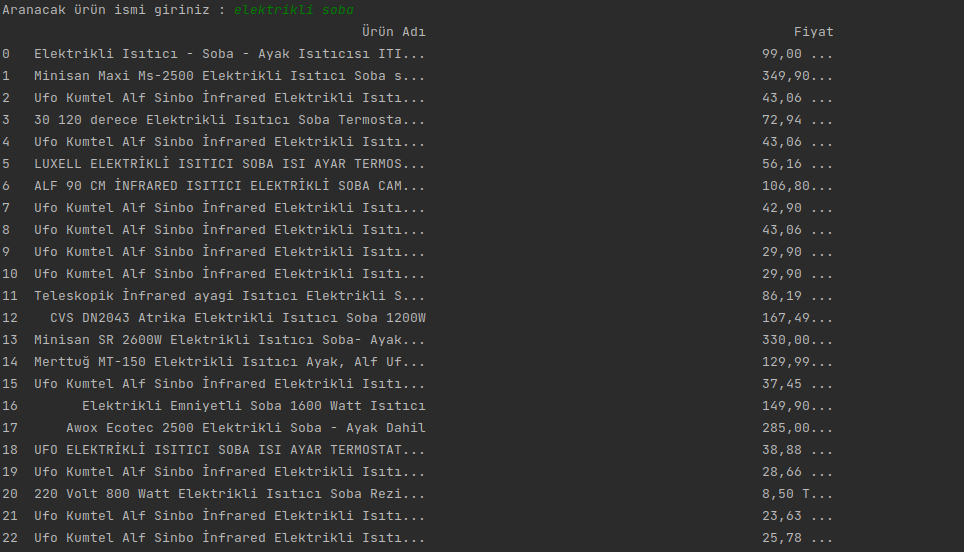
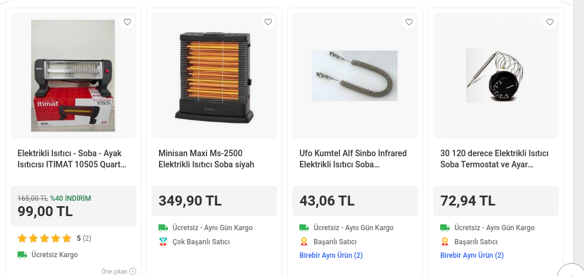
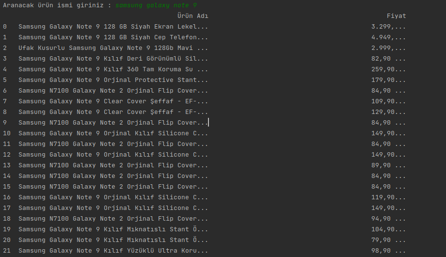
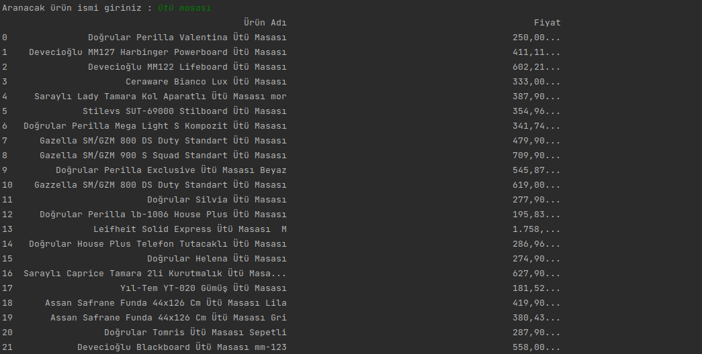

# veriscrapy

# GİTTİGİDİYOR V.0.0.1

Gittigidiyordan istenilen ürün aramaya göre çıkan sonuçları pandas ile listeliyoruz.

# Nasıl yüklenilir ?

Python 2.x

pip install -r requirements.txt

Python 3.x

pip3 install -r requirements.txt

# Nasıl Çalıştırırız ?

Python 2.x

python main.py

Python 3.x

python3 main.py

# Örnek 1

python3 main.py çıktısı : elektrikli soba

gittigidiyor karşılaştırma : 

# Örnek 2

python3 main.py çıktısı : samsung galaxy note 9

gittigidiyor karşılaştırma : 

# Örnek 3

python3 main.py çıktısı : samsung galaxy note 9

gittigidiyor karşılaştırma : 

